# Sequence Diagrams — Multi-material Upgrade

Sequence-diagrammen voor alle systeemprocessen zoals beschreven in
[spec.md](spec.md), [contracts/usb-serial.md](contracts/usb-serial.md),
[contracts/i2c-frames.md](contracts/i2c-frames.md),
[STATE_TRANSITIONS.md](STATE_TRANSITIONS.md) en
[SLAVE_STATE_TRANSITIONS.md](SLAVE_STATE_TRANSITIONS.md).

**Topologie in alle diagrammen**: 1× Klipper (printer), 1× Master, 3× Slaves
(`S1`, `S2`, `S3`) — in deze fysieke EN-chain-volgorde. T-indices mappen op
positie: `T0 → S1`, `T1 → S2`, `T2 → S3` (FR-003-MAP).

> Mermaid-conventies in dit document:
> - Lifelines: `Klipper`, `Master`, `S1`, `S2`, `S3`.
> - `Note over X` = state-overgang of belangrijk side-effect.
> - I2C-frames: `PING` impliceert vervolgens `requestFrom(4)` (status-frame),
>   tenzij anders genoteerd.
> - Diagnose-regels (`# …`) op USB-serial worden weggelaten voor leesbaarheid.

---

## 1. Boot & enumeratie (EN-chain handshake)

Initiële opstart: Master enumereert via dynamische EN-handshake en wijst
adressen `0x50, 0x51, 0x52` toe op basis van fysieke positie (FR-014/015,
[i2c-frames.md § Enumeration sequence](contracts/i2c-frames.md)).

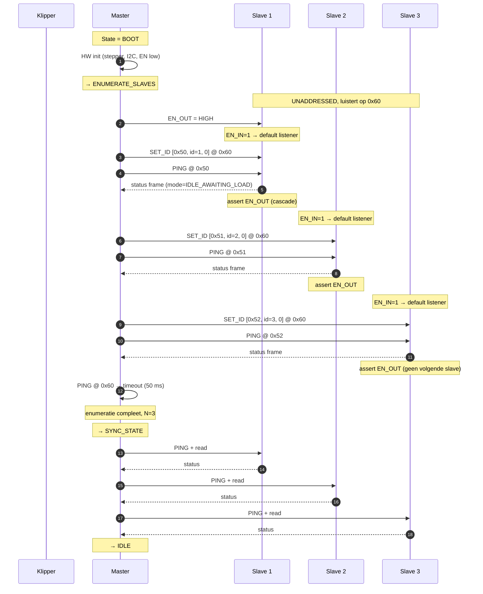

---

## 2. Periodieke polling in IDLE (50 ms cadens)

Master polt elke online slave elke `POLL_SLAVE_INTERVAL_MS = 50 ms` zolang
geen materiaalwissel actief is (FR-013/013a,
[i2c-frames.md § Polling cadence](contracts/i2c-frames.md)).

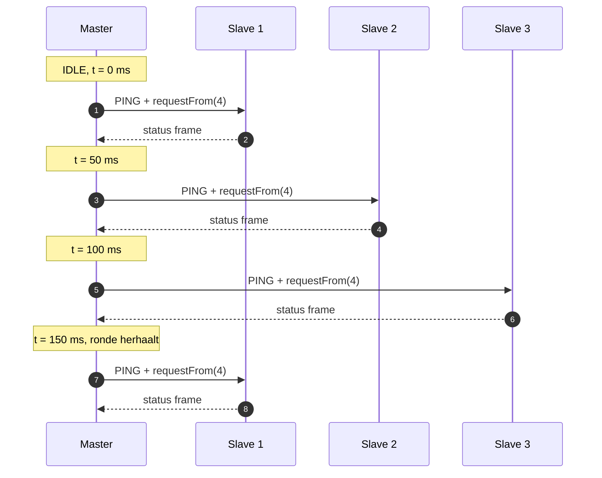

---

## 3. Hot-plug — nieuwe slave aansluiten (idle)

Een 4e slave wordt mechanisch + elektrisch toegevoegd aan het einde van de
chain (US2 / FR-008 / FR-014). Master detecteert de topologie-verandering bij
de eerstvolgende broadcast en voert een volledige re-enumeratie uit.

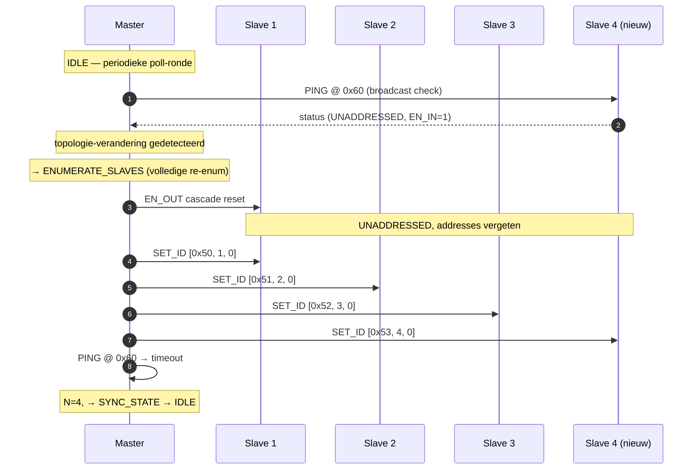

---

## 4. Hot-plug — slave verwijderen (idle)

Slave S2 wordt fysiek losgekoppeld terwijl Master idle is. EN-chain breekt;
volgende poll-cyclus detecteert NACK (FR-008 / FR-014).

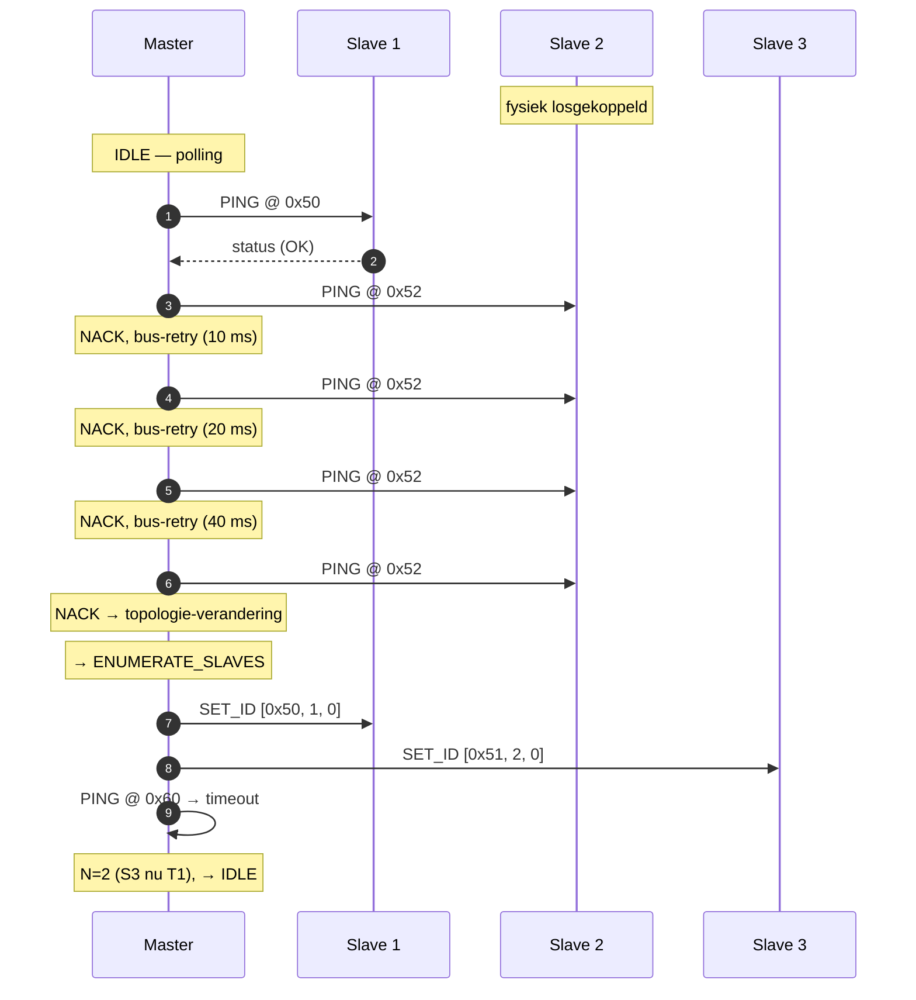

> Let op: door positionele mapping (FR-003-MAP) verwijst `T1` na deze
> re-enum naar de oude S3.

---

## 5. Proces 1 — `L<n>`: filament in slave laden (US1 voorbereiding)

Operator steekt handmatig filament in slave 1 (`L0`). Master zet S1 in
`IDLE_AWAITING_LOAD`; sensor B detecteert filament; servo knijpt autonoom;
S1 eindigt in `READY` (LED groen).

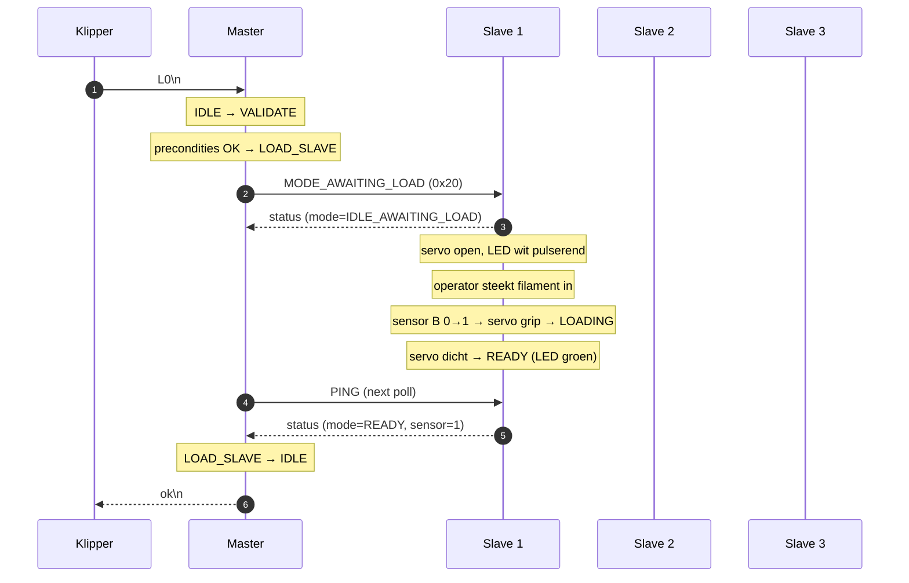

**Foutpad — sensor blijft passief**: na `FEED_TIMEOUT_MS = 5000` zonder
sensor-activatie meldt S1 `FAULT` → Master `fail16` (ERR_FEED_TIMEOUT) →
Klipper `PAUSE` (FR-007/FR-011/FR-003c).

---

## 5b. Autonome `L<n>` — operator steekt filament in lege slave (FR-005a)

Master is in `IDLE`; S2 staat in `IDLE_AWAITING_LOAD` (LED wit pulserend).
Operator duwt filament in S2 zonder dat Klipper een `L1` heeft gestuurd. De
slave detecteert de sensor-activatie autonoom, knijpt de servo en gaat naar
`READY`. Master ziet de transitie bij de eerstvolgende poll, werkt zijn
bookkeeping bij en emit een diagnose-regel. Er gaat **geen** USB-serial-
respons naar Klipper (de gebeurtenis is niet host-initiated).

```mermaid
sequenceDiagram
    autonumber
    participant K as Klipper
    participant M as Master
    participant S1 as Slave 1
    participant S2 as Slave 2
    participant S3 as Slave 3

    Note over M: IDLE — autonome trigger toegestaan
    Note over S2: IDLE_AWAITING_LOAD (LED wit pulserend)

    Note over S2: operator steekt filament in
    Note over S2: sensor B 0→1 → servo grip → LOADING
    Note over S2: servo dicht → READY (LED groen)

    M->>S2: PING (volgende poll)
    S2-->>M: status (mode=READY, sensor=1)
    Note over M: bookkeeping: S2 = READY
    M-->>K: # <ts> 2 L OK 0\n
    Note over K: diagnose-regel; geen ok/fail vereist
```

### Gating tijdens een in-flight proces

Wanneer de master uit `IDLE` vertrekt (bv. `T0`) zet hij alle lege slaves naar
de passieve `MODE_READY`-equivalent zodat operator-insteek NIET autonoom wordt
opgepikt. Bij terugkeer naar `IDLE` zet hij ze terug naar `MODE_AWAITING_LOAD`.

```mermaid
sequenceDiagram
    autonumber
    participant K as Klipper
    participant M as Master
    participant S2 as Slave 2 (leeg)
    participant S3 as Slave 3 (leeg)

    Note over M: IDLE; S2 en S3 in IDLE_AWAITING_LOAD
    K->>M: T0\n
    Note over M: IDLE → VALIDATE → (proces start)
    par insertion-disable lege slaves
        M->>S2: MODE_READY (0x23, passief)
    and
        M->>S3: MODE_READY (0x23, passief)
    end
    Note over S2,S3: sensor-activatie wordt niet meer autonoom opgepikt

    Note over M: … tool change voltooit …
    M-->>K: ok\n
    Note over M: terug in IDLE — re-arm autonome trigger
    par re-enable
        M->>S2: MODE_AWAITING_LOAD (0x20)
    and
        M->>S3: MODE_AWAITING_LOAD (0x20)
    end
```

> Een filament-insteek **tijdens** de in-flight procedure is geen fout: de
> slave registreert het pas wanneer de master hem na terugkeer naar `IDLE`
> opnieuw in `MODE_AWAITING_LOAD` zet en de sensor nog steeds actief is; de
> autonome `LOADING`-transient wordt op dat moment alsnog uitgevoerd.

---

## 6. Proces 2 — `U<n>`: filament uit slave ejecten

Operator laat filament uitwerpen uit slave 1 (`U0`). Servo knijpt, master
draait stepper reverse, sensor B deactiveert, S1 eindigt in `EMPTY` (LED uit).

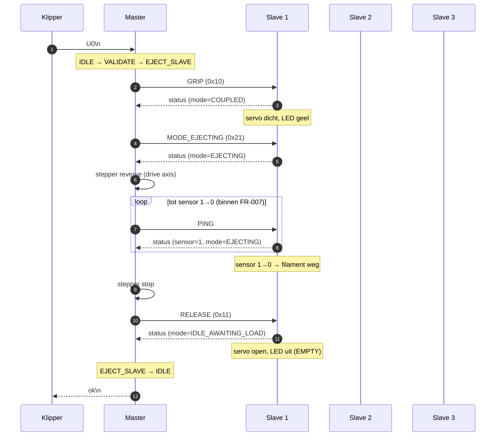

**Foutpad**: sensor blijft `1` na `FEED_TIMEOUT_MS` → S1 → FAULT, Master
`fail16`, Klipper `PAUSE` (FR-007/FR-010a).

---

## 7. Proces 3 — Tool change `T<nr>` met FR-004a-sequentie (US1 hoofdscenario)

Initiële situatie: filament van slave 1 is geladen in de hotend
(`coupled=1`, `tool=0`, S1 in `IN_PRINTER`). Klipper stuurt `T1` (wissel naar
slave 2). Master voert sequentieel: (1) unload S1, (2) verifieer sensor=0,
(3) load S2, (4) verifieer sensor=1 — conform FR-004a.

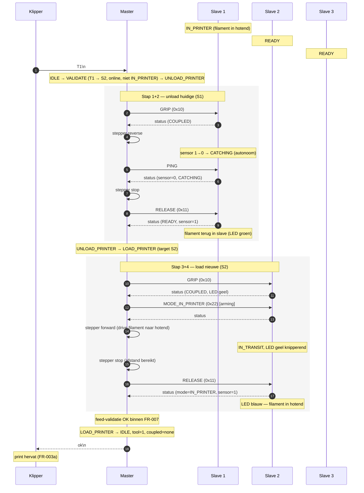

> **Edge case `T1` terwijl al geladen**: als `tool==1` reeds geldt antwoordt
> Master direct `algeladen` zonder hardware-actie.

---

## 8. Proces 4 — `UNLOAD_PRINTER`: filament terug uit hotend zonder load

Klipper stuurt bv. `T-1`-equivalent of een retract-macro (intern als unload-
procedure). Hier expliciet getoond als zelfstandige unload van S1.

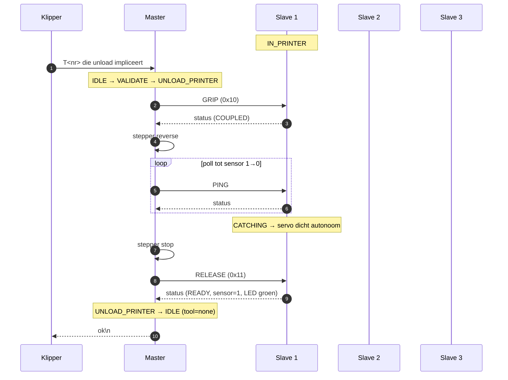

---

## 9. US3 — Toevoerfout met automatische retry (FR-007 / FR-011 / FR-011a)

Tijdens stap 4 van een `T2`-wissel (load S3 naar hotend) blijft sensor B
inactief. Master retryt **alleen de falende sub-stap** op dezelfde slave met
exponentiële backoff 1 s / 2 s / 4 s. Na 3 mislukte pogingen → `fail16`.

```mermaid
sequenceDiagram
    autonumber
    participant K as Klipper
    participant M as Master
    participant S1 as Slave 1
    participant S2 as Slave 2
    participant S3 as Slave 3

    K->>M: T2\n
    Note over M: unload huidig (S1) succesvol — niet opnieuw aangeraakt bij retries

    rect rgb(255,245,245)
        Note over M,S3: Poging 1
        M->>S3: GRIP
        S3-->>M: status (COUPLED)
        M->>M: stepper forward
        loop tot 5 s
            M->>S3: PING
            S3-->>M: status (sensor=0)
        end
        Note over M: FEED_TIMEOUT → backoff 1 s
        M->>S3: RELEASE
    end

    rect rgb(255,245,245)
        Note over M,S3: Poging 2
        M->>S3: GRIP
        M->>M: stepper forward
        loop tot 5 s
            M->>S3: PING
            S3-->>M: status (sensor=0)
        end
        Note over M: FEED_TIMEOUT → backoff 2 s
        M->>S3: RELEASE
    end

    rect rgb(255,245,245)
        Note over M,S3: Poging 3
        M->>S3: GRIP
        M->>M: stepper forward
        loop tot 5 s
            M->>S3: PING
            S3-->>M: status (sensor=0)
        end
        Note over M: FEED_TIMEOUT → kanaal naar FAULT
    end

    M->>S3: SET_LED (rood)
    Note over S3: FAULT (LED rood)
    M-->>K: fail16\n
    Note over K: PAUSE (FR-003c); operator kiest herstel
```

Na operator-keuze "wissel naar alternatief kanaal" wordt een **volledige
nieuwe FR-004a-sequentie** gestart naar bv. S2 (FR-011a).

---

## 10. I2C-busfout met bus-retry (FR-017)

Tijdens een `GRIP` naar S2 antwoordt de bus met NACK. Master retryt het
**zelfde I2C-commando** 3× met backoff 10/20/40 ms. Telt NIET mee voor
FR-011-retries.

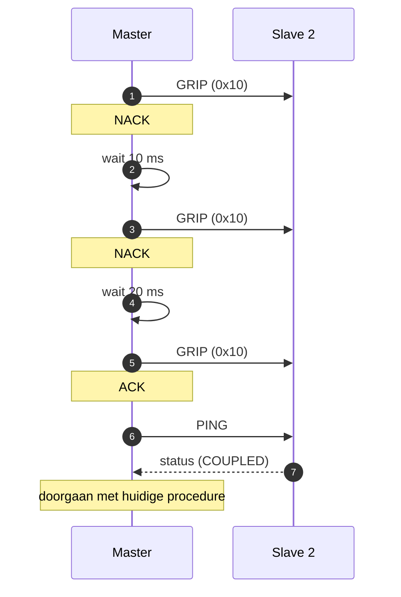

Indien ook na de 3e retry NACK → kanaal naar `FAULT`, Master `fail32`
(ERR_BUS_TIMEOUT) → Klipper `PAUSE`.

---

## 11. Reset-procedure (`R`)

Klipper stuurt `R`; master onderbreekt elke in-flight operatie, reset alle
slaves naar `EMPTY` / `IDLE_AWAITING_LOAD` en herstart enumeratie-/sync-cyclus
(FR-016).

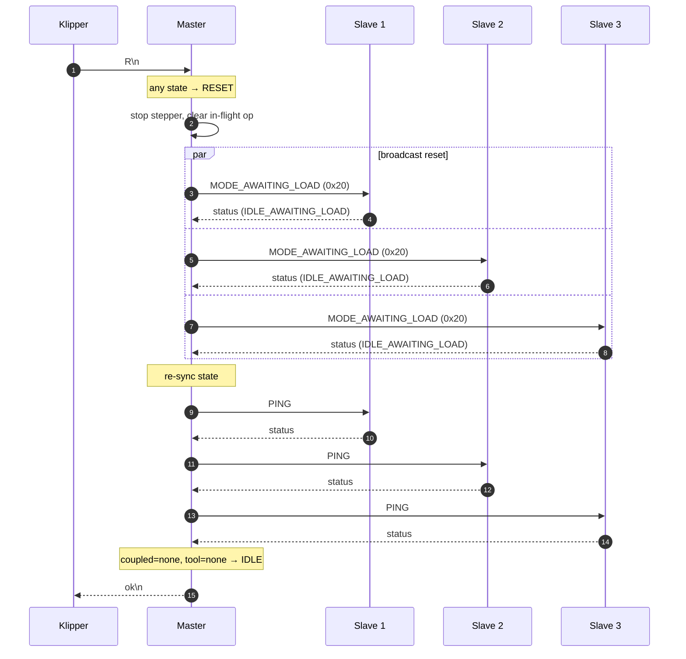

---

## 12. Status-query (`S`)

Niet-blokkerend; antwoordt direct met de huidige master-state-regel
([usb-serial.md § Response to `S`](contracts/usb-serial.md)).

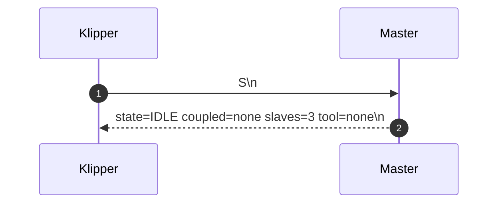

---

## 13. `busy` — overlappend commando tijdens in-flight operatie (FR-019)

Klipper stuurt foutief een tweede `L0` terwijl Master nog een `T1` aan het
afhandelen is. Master antwoordt `busy`; Klipper retryt na
`BUSY_RETRY_HINT_MS = 500 ms` tot het in-flight commando voltooid is.

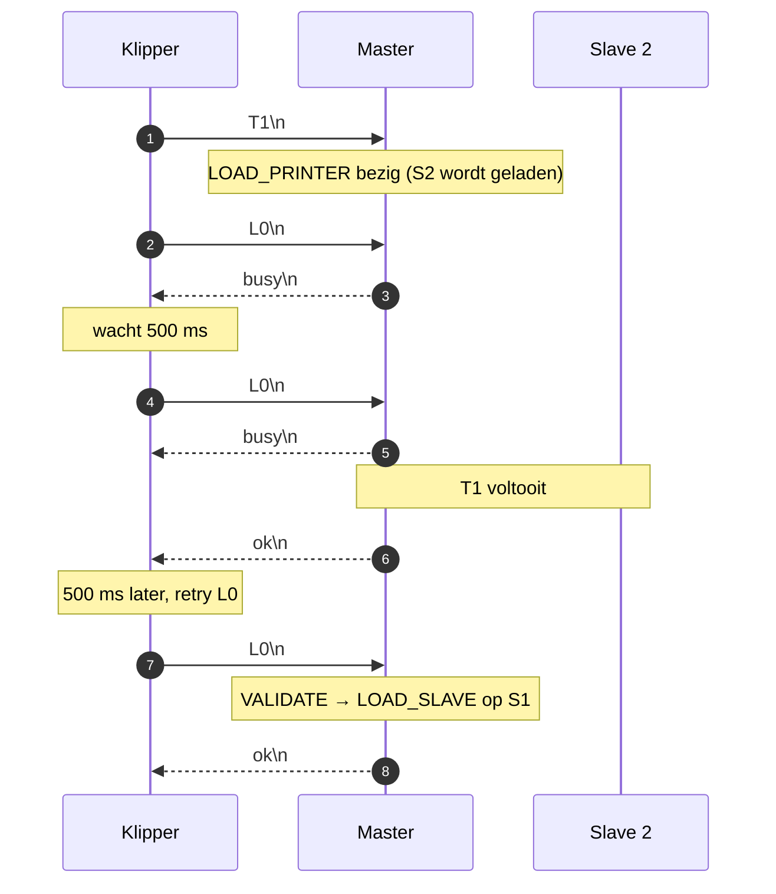

---

## 14. FAULT-state — alleen `S` en `R` geaccepteerd

Na een fatale fout (bv. uitgeputte bus-retries op S2) blijft Master in
`FAULT` tot operator een `R` stuurt.

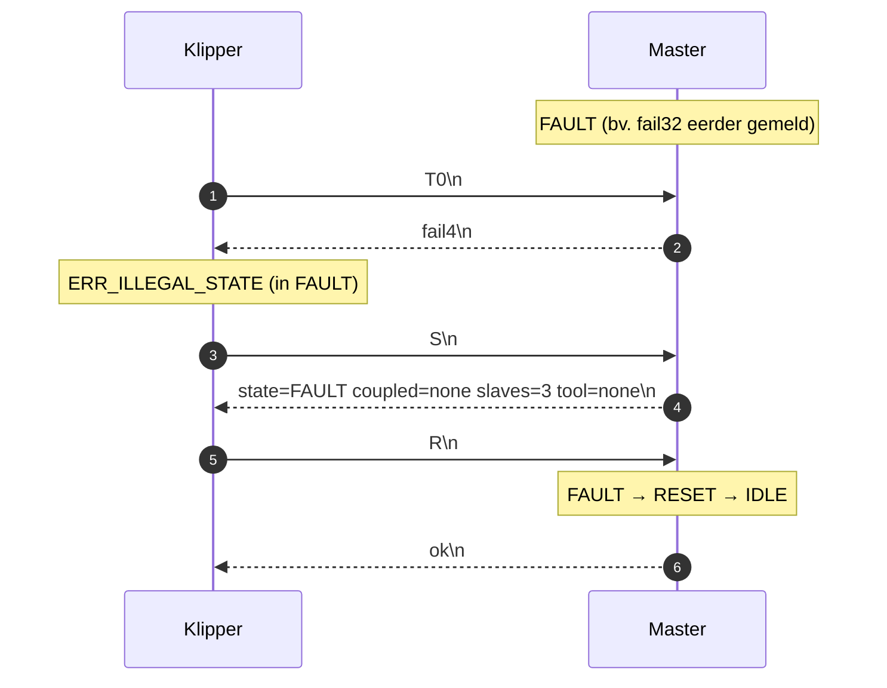

---

## Cross-referenties

| Diagram | Primaire requirements |
|---------|----------------------|
| 1. Boot & enum | FR-014, FR-015, FR-016 |
| 2. Polling | FR-013, FR-013a |
| 3. Hot-plug add | FR-008, FR-014 |
| 4. Hot-plug remove | FR-008, FR-009, FR-014 |
| 5. `L<n>` load slave | FR-005, FR-006, FR-010a |
| 5b. Autonome load-trigger | FR-005a, FR-013, FR-020 |
| 6. `U<n>` eject | FR-006, FR-010a |
| 7. `T<nr>` tool change | FR-003, FR-003a, FR-003-MAP, FR-004, FR-004a, FR-012 |
| 8. Unload printer | FR-004a, FR-010a |
| 9. Feed-retry | FR-007, FR-011, FR-011a, FR-003b, FR-003c |
| 10. Bus-retry | FR-017 |
| 11. Reset | FR-016 |
| 12. Status | FR-020, usb-serial.md |
| 13. Busy / serialisatie | FR-019 |
| 14. FAULT-gedrag | FR-003b, FR-003c, FR-016 |
